### TCP/IP란
TCP/IP는 인터넷에서 데이터를 주고받기 위한 네트워크 프로토콜을 의미합니다.

TCP는 Transmission Control Protocol로 해석하면 전송 제어 프로토콜이 됩니다.
인터넷에서 데이터를 주고 받을 때, 중간에 손실이 되지 않도록 보장을 하고 순서가 뒤바뀌지 않도록 정리해서 보내주는 역할을 합니다.
예시로, 지하철 wi-fi를 사용해서 인터넷 검색을 할때, 검색이 안되는 경우가 있습니다.
이런 경우는 Wi-Fi 신호가 약해지거나 네트워크가 불안정할 때, 데이터가 중간에 일부 손실되기 때문에 발생하는 일입니다.

### 데이터 패킷
인터넷에서 데이터를 전송할 때, 작은 조각(패킷)으로 나누어 보내는 단위를 말합니다.

### 데이터 패킷을 쪼개는 이유

인터넷에서 한 번에 큰 데이터를 전송하면 네트워크가 과부하될 수 있기 때문에, 작은 단위로 쪼개서 전송하고, 도착한 후 다시 조립하는 방식을 사용합니다.

### TCP가 신뢰성을 보장하는 방법

패킷 손실이 발생하면 재전송하고, 순서가 뒤바뀌지 않도록 정리하는 기능을 제공합니다.

### IP란

IP는 인터넷에서 데이터를 목적지까지 전달하기 위한 주소 지정 및 경로 설정(라우팅)을 담당하는 프로토콜입니다.
쉽게 말해, 택배를 받는 상황에 비유하면 다음과 같습니다.
IP 주소 = 집 주소 🏠 (데이터가 어디로 가야 하는지 결정)
데이터 패킷 = 택배 상자 📦 (전송되는 데이터)
라우터(Router) = 택배 회사 🚛 (데이터를 최적의 경로로 전달)

### IP의 역할
데이터가 정확한 목적지까지 도착하도록 주소를 지정하고 경로를 설정하는 역할을 합니다.
쉽게 말해, 데이터를 목적지까지 안내하는 네트워크 내비게이션 역할을 합니다.

### TCP/IP의 계층수
TCP/IP 4계층
TCP/IP는 아래 그림과 같이 4개의 계층으로 되어있습니다. 기존 OSI 7계층을 단순화한 것이라고 생각하면 됩니다.

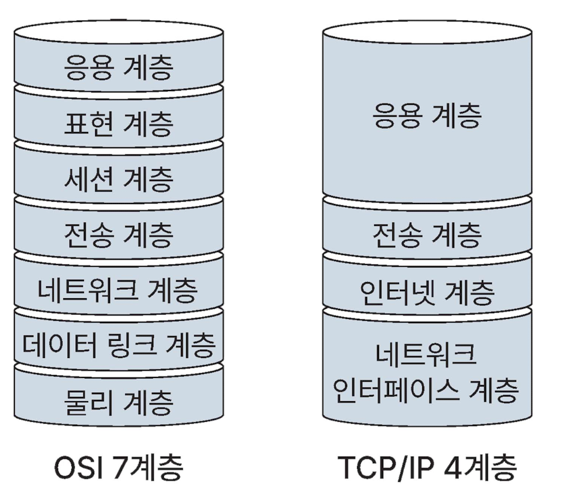

### TCP/IP 각 계층의 역할

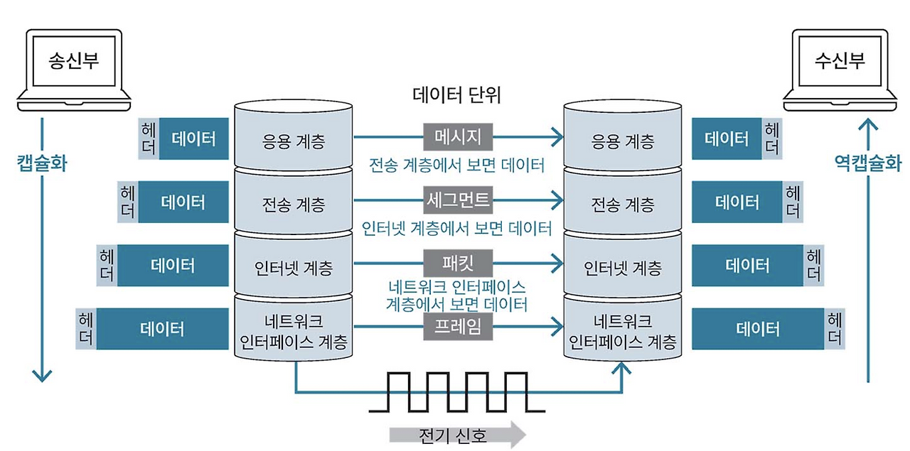

#### 응용 계층(4계층)

응용 계층은 사용자와 소프트웨어를 연결해주는 계층입니다. HTTP, HTTPS, DNS등의 프로토콜이 작동하게 됩니다.
쉽게 말해, 사용자가 직접 접하는 인터넷 서비스를 담당하는 계층을 의미합니다.
우리가 자주 접하는 대표적인 예시로는 아래와 같습니다.
사용자가 웹 브라우저(Chrome, Edge, Safari) 에서 https://www.naver.com 입력한 순간, 응용 계층에서 HTTP / HTTPS 프로토콜이 동작하여 웹 서버에 요청을 보내게 됩니다.

### 전송 계층(3계층)

전송 계층은 데이터의 신뢰성을 보장하고, 적절한 응용 프로그램(프로세스)로 데이터를 전달하는 역할을 합니다.
쉽게 말해, 데이터가 빠짐없이 제대로 도착했는지 확인하고, 해당 데이터를 어떤 프로그램이 받아야 할지 결정하는 계층을 의미합니다.
TCP와 UDP가 이 계층에 해당됩니다. 전송 계층의 데이터 단위는 세그먼트를 사용합니다.

### 포트 번호
포트 번호(Port Number)는 같은 컴퓨터 내에서 여러 개의 프로그램(응용 서비스)이 실행될 때, 어떤 프로그램이 데이터를 받을지 구분하는 역할을 합니다.

### UDP
UDP(User Datagram Protocol) 는 빠른 데이터 전송을 우선시하는 프로토콜로, TCP와 달리 데이터가 손실될 수도 있지만, 빠르게 전송하는 것이 목적인 프로토콜입니다.

### 세그먼트
세그먼트(Segment) 는 전송 계층(Transport Layer)에서 데이터를 나누어 처리하는 단위입니다.
즉, 애플리케이션에서 보낸 데이터를 적절한 크기로 나눠서 전송하는 데이터 조각을 의미합니다.

### 세그먼트와 패킷의 차이점
세그먼트"는 데이터가 네트워크를 타고 가기 전에 적절한 크기로 나눈 조각이고, 패킷은 IP 주소가 포함되어 최종 목적지까지 가는 데이터입니다. 사용되는 계층은 다르지만, 작은 조각으로 나누어 전송한다는 점은 동일합니다.
세그먼트와 패킷을 택배의 상황으로 비유하면 다음과 같습니다.
세그먼트는 택배 상자에 담을 물건을 적절한 크기로 포장하는 과정이며, TCP/UDP가 데이터를 나누고 포트 번호(어떤 프로그램이 받을지)를 추가합니다.
패킷은 택배 상자에 주소 라벨을 붙여서 어디로 보낼지 지정하는 과정이며, 네트워크 계층에서 IP 주소를 추가하여 최적의 경로를 통해 목적지로 전달합니다.

### 인터넷 계층(2계층)

인터넷 계층은 데이터를 목적지까지 전달하기 위해 IP 주소를 이용한 경로 설정(라우팅)을 담당하는 계층입니다.
쉽게 말해, 어디로 보낼지(IP 주소 지정)와 어떻게 보낼지(경로 설정)"를 결정하는 계층입니다.
이전에 나온 설명과 같이 인터넷 계층에서 처리하는 데이터이 단위는 패킷입니다.

### 네트워크 인터페이스 계층(1계층)

네트워크 인터페이스 계층은 데이터를 물리적으로 전송하는 계층입니다.
데이터를 전기 신호로 변환하고 MAC 주소를 사용해 기기에 데이터를 전달합니다.
쉽게 말해,데이터를 네트워크 케이블, 와이파이, 광섬유 등을 통해 물리적으로 전송하는 계층입니다.

### 맥주소
MAC 주소(Media Access Control Address) 는 네트워크에 연결된 각 기기에 할당된 고유한 식별자입니다.
즉, 네트워크 카드(인터페이스)에 부여된 고유한 주소로, 로컬 네트워크에서 데이터가 정확한 기기에 도달할 수 있도록 하는 역할을 합니다.
쉽게 말해, 하드웨어를 식별하는 고유한 주소라고 생각하면 됩니다.

인터넷 계층에서는 IP 주소를 사용해서 데이터가 어디로 가야 할지(목적지)를 지정해줬습니다. 하지만 데이터가 네트워크에 들어온 후, 최종적으로 어떤 기기(컴퓨터, 스마트폰 등)에 도착할지를 지정하기 위해 MAC 주소가 필요합니다.
즉, IP 주소는 데이터가 어떤 네트워크(네트워크 간 이동)로 가야 할지를 지정하고, MAC 주소는 데이터가 같은 네트워크 안에서 어떤 기기로 가야 할지를 지정하게 됩니다.

### TCP
송신부와 수신부의 연결을 확인하는 연결형 서비스입니다.
패킷 교환 방식은 패킷이 전달되는 회선이 정해져 있는 가상 회선 방식입니다.
패킷의 전송 순서가 보장됩니다.
패킷의 수신 여부를 확인합니다.
송신부와 수신부는 1:1 통신을 합니다.
데이터 손실이 없음을 보장하기 때문에 신뢰성이 높습니다.
데이터의 송수신 속도가 느립니다.

### 가상 회선 방식
가상 회선 방식은 데이터를 주고 받기 전에 패킷을 전송할 경로로 가상 회선을 설정해서 모든 패킷을 같은 경로로 전송하는 방식입니다.
쉽게말해, 데이터를 보내기 전에 길을 미리 정해놓고, 모든 데이터가 같은 길로 이동하는 방식입니다.
미리 정해 놓은 길에 데이터를 보내므로 자연스럽게 순서가 보장되게 됩니다.

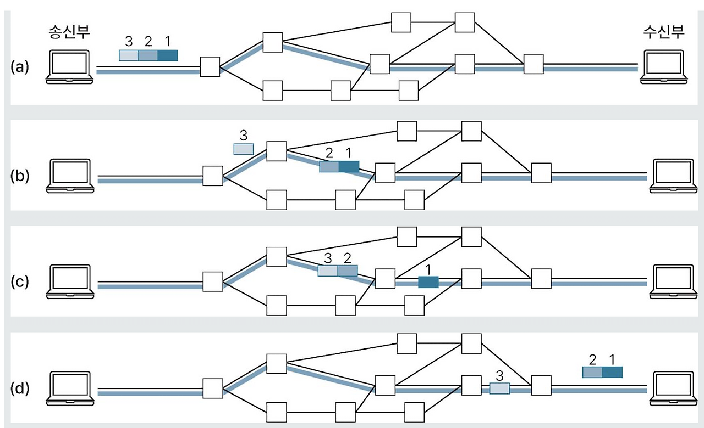

### 핸드 셰이킹

핸드셰이킹(Handshake) 은 TCP에서 송신부와 수신부가 데이터를 주고받기 전에 연결을 설정하는 과정을 의미합니다.
쉽게 말해서, 서로 통신이 가능한 상태인지 확인하고, 데이터 전송을 준비하는 과정입니다. 3-way 핸드 셰이킹과 4-way 핸드 셰이킹 2가지 종류가 있습니다.

### 핸드 셰이킹을 하는 이유ㅣ

핸드셰이킹을 하면 "서로 통신 가능"한 상태에서만 데이터를 주고받기 때문에, 손실 없이 안정적인 연결을 유지할 수 있습니다.

### 3-way 핸드 셰이킹
TCP에서 송신부(클라이언트)와 수신부(서버)가 데이터를 주고받기 전에 안정적인 연결을 설정하는 과정입니다.
쉽게 말해, 서로 통신할 준비가 되었는지 확인하는 3단계 과정입니다.

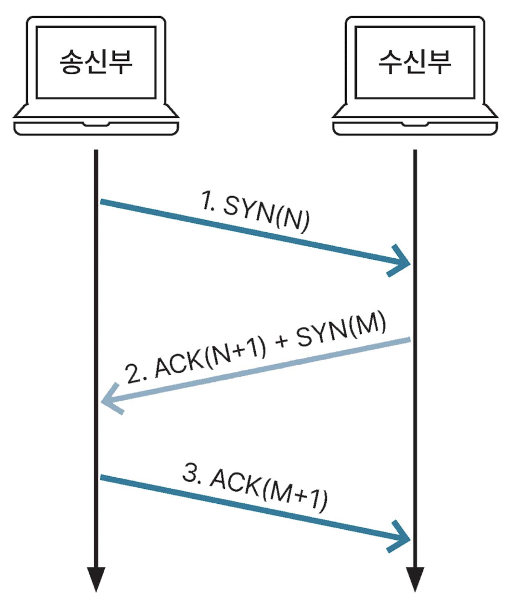

각 순서는 다음과 같습니다.

1. 송신부가 수신부와 연결하기 위해서 SYN(N)이라는 메시지를 보내게 됩니다. 이때 임의의 숫자인 N과 함께 보내게 됩니다. 송신부는 수신부로 응답이 오기 전에는 SYN_SENT(연결 요청을 보냈지만, 아직 서버의 응답을 기다리고 있는 상태) 상태가 됩니다.
2. 수신부가 송신부로부터 SYN 메시지를 받으면, 연결 요청을 허락한다는 의미인 ACK 메시지를 전송합니다. 이때, 수신부는 전 단계에서 송신부로부터 받은 임의의 숫자 N에 1을 더한 N+1의 값을 함께 보내게 됩니다. 추가로, SYN 메시지에 임의의 숫자 M을 함께 보내고 송신부의 응답을 기다리게 됩니다. 이때 수신부는 SYN_RECEIVED(연결 요청을 승인했지만, 아직 송신부의 최종 확인[ACK]을 기다리는 상태) 상태가 됩니다.
3. 송신부가 수신부로부터 ACK + SYN 메시지를 받는 경우, 연결이 성립된다는 의미인 established 상태가 됩니다. ACK + SYN 메시지에 대한 응답으로 ACK 메시지와 이전 단계에서 받은 임의의 숫자 M에 1을 더한 M+1 값을 함께 보냅니다. 이때, ACK 메시지에는 송신부에서 전송하려는 데이터가 포함될 수 있습니다. 최종적으로 송신부로부터 ACK 메시지를 받은 수신부도 established 상태가 됩니다.

### ACK, SYN
SYN (Synchronize)는 연결 요청을 의미하고, ACK (Acknowledge)는 요청 승인을 의미합니다.
SYN(Synchronize)과 ACK(Acknowledge)는 TCP 핸드셰이킹에서 연결을 설정하고 응답을 확인하는 데 사용됩니다.
N과 M이라는 임의의 숫자(시퀀스 번호, Sequence Number)는 데이터의 순서를 유지하고, 중복이나 보안 문제를 방지하기 위해 필요합니다.

### N과 M의 순서,중복, 보안 문제 방지

순서
인터넷 환경에서는 패킷이 여러 경로로 이동하며 순서가 바뀔 가능성이 있습니다. TCP는 이를 방지하기 위해 각 패킷에 고유한 번호(시퀀스 번호)를 부여하여 순서를 유지합니다.

중복
인터넷은 네트워크가 불안정할 경우, 같은 패킷이 여러 번 전송될 수 있습니다. 서버가 N 값을 보고, 같은 패킷인지 아닌지를 구분할 수 있습니다.

보안
N과 M이 없으면, 공격자가 서버와 클라이언트의 통신을 쉽게 가로챌 수 있습니다. 매번 랜덤한 시퀀스 번호를 사용하면, 공격자가 중간에 끼어들어도 패킷을 변조하기 어려워집니다.

### TCP/IP 방식의 패킷 전달 순서

(1) TCP 연결 설정 (3-way Handshake)합니다.  
(2) TCP가 데이터를 작은 패킷으로 쪼개고 IP를 통해 전송 합니다.  
(3) IP는 데이터그램 방식으로 패킷을 여러 경로로 보냅니다. (순서가 바뀌거나 일부 손실될 수 있음)  
(4) 수신 측에서 TCP가 시퀀스 번호를 보고 패킷을 올바른 순서로 정렬합니다.  
(5) 손실된 패킷이 있으면 TCP가 재전송 요청 & 복구합니다.  

### 데이터크램 방식
데이터그램 방식은 패킷을 보낼 때 미리 정해진 경로 없이, 각각의 패킷이 독립적으로 최적의 경로를 찾아 이동하는 방식입니다.
또한, 네트워크 부하를 줄이고 유연한 데이터 전송을 위해 사용됩니다.

### 4-way 핸드 셰이킹
4-Way 핸드 셰이킹은 TCP 연결을 종료할 때 사용하는 방식입니다.
4단계 과정을 통해 연결을 해제하게 됩니다.
4-way 핸드 셰이킹의 과정은 다음 그림과 같습니다.

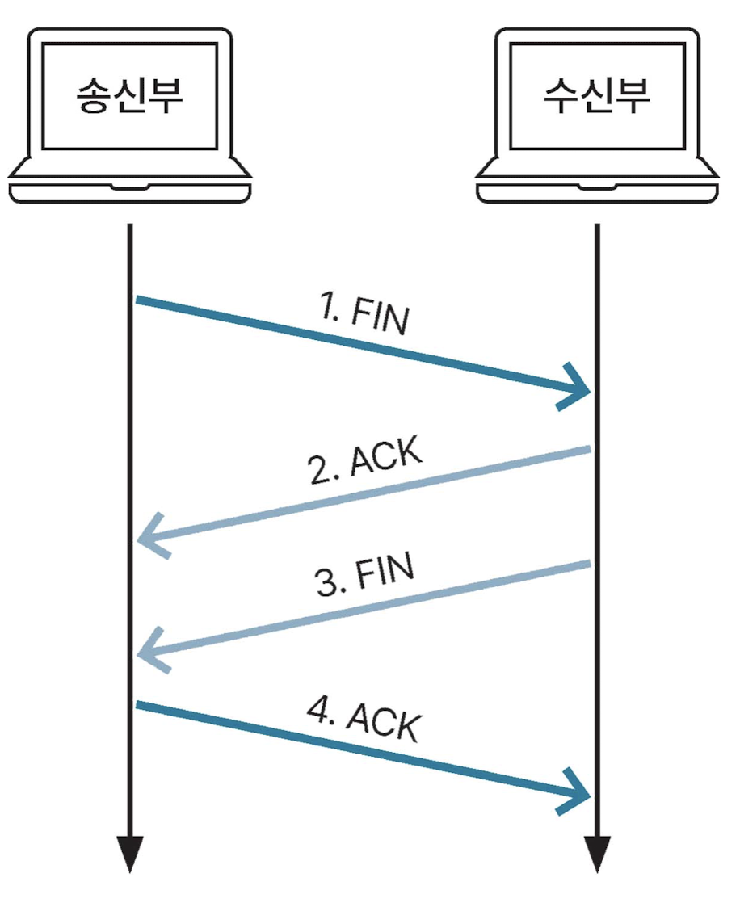

1. 송신부가 수신부와 연결을 종료하기 위해, FIN 메시지를 보내게 됩니다. 이때 송신부는 FIN_WAIT1 상태가 됩니다.
2. 수신부가 송신부로부터 FIN 메시지를 받으면 응답값으로 ACK를 보냅니다. 이때 수신부는 CLOSE_WAIT 상태가 됩니다. 수신부는 메시지를 보낸 후, 어플리케이션을 종료하는 등 연결을 종료하기 위한 작업을 합니다. 송신부는 수신부에서 보낸 ACK 메시지를 받고, FIN_WAIT2 상태가 됩니다.
3. 수신부에서 연결을 종료할 준비가 되면, 송신부에 FIN메시지를 보내고, LAST_WAIT 상태가 됩니다.
4. 송신부는 서버로부터 받은 FIN 메시지에 응답하기 위해서 ACK 메시지를 보내고 TIME_WAIT 상태가 됩니다. 이 상태에서 일정 시간이 지나게 되면 CLOSED 상태가 됩니다. 수신부는 송신부로부터 ACK 메시지를 받고 CLOSED 상태가 됩니다.

### FIN

FIN(Finish) 메시지는 "더 이상 보낼 데이터가 없으므로 연결을 종료하겠다"는 의미입니다.
즉, 송신부(클라이언트 또는 서버)에서 더 이상 데이터를 전송할 필요가 없을 때, FIN을 보내 연결을 끊겠다는 신호를 전달하는 것입니다.
 
### 4번째 과정에서 TIME_WAIT 상태가 되는 이유
결론부터 말하면, FIN 메시지 이전에 보낸 패킷이 FIN 메시지 수신보다 지연되어 발생하는 패킷 유실에 대비하고, 수신부에 ACK 메시지가 제대로 전달되지 않아 연결 해제가 이뤄지지 않는 경우도 대비하기 위해서입니다.

### 정리
TCP/IP는 인터넷에서 데이터를 주고받기 위한 네트워크 프로토콜입니다.
TCP/IP는 응용 계층, 전송 계층, 인터넷 계층, 네트워크 인터페이스 계층으로 구성됩니다. 전송 계층에서는 데이터 단위를 세그먼트(Segment)로 나누고, 인터넷 계층에서는 이를 패킷(Packet) 단위로 전송합니다.
TCP는 연결을 설정할 때 3-Way Handshake, 연결을 종료할 때 4-Way Handshake를 사용하여 신뢰성을 보장합니다.
즉, TCP/IP는 데이터를 안전하고 효율적으로 주고받기 위해 계층 구조와 핸드셰이킹 과정을 활용하는 핵심 네트워크 프로토콜입니다.

### TCP 제어 방법
TCP는 신뢰성을 보장하기 위해 흐름 제어, 혼잡 제어, 오류 제어를 합니다.

### 흐름 제어
흐름 제어는 송신부와 수신부 사이에 생기는 데이터 처리 속도의 차이로 인해 생기는 데이터 손실을 방지하는 방법입니다.
쉽게 말해, 이름 그대로 흐름을 제어하는 것입니다.

### 흐름제어의 방법
흐름제어 방법은 크게 정지 대기(stop-wait), 슬라이딩 윈도우(sliding window) 방식이 있습니다.

### 정지 대기(stop-wait)
송신부에서 수신부로 데이터를 보낸 후, 송신부는 수신부로부터 ACK 메시지를 받을 때까지 기다리다가 ACK 메시지를 받으면, 그때 다음 데이터를 보내는 방식입니다.이 방식은 이전 메시지에 대한 응답을 받아야만 다음 메시지를 보낼 수 있다는 부분에서 시간적인 비용이 많이 든다는 단점이 있습니다.
이 방식은 아래 그림과 같이 진행됩니다.

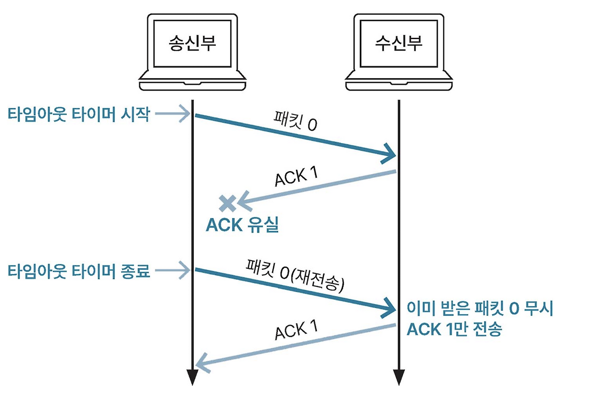

### 송신부가 ACK 메시지를 오랜시간 동안 전달받지 못하는 경우
송신부에서 응답받지 못했던 패킷을 재전송합니다.

### 슬라이딩 윈도우(sliding window)
송신부에서 데이터의 수신 여부(ACK)를 확인하지 않고 수신부에 설정한 윈도우 크기만큼 데이터를 연속적으로 보낼 수 있게 해서 데이터 흐름을 동적으로 제어하는 방식입니다. 윈도우 크기는 응답과 상관 없이 보낼 수 있는 데이터의 최대 개수를 의미합니다.
이 윈도우는 3-way 핸드 셰이킹 과정에서 정해집니다.

윈도우 크기를 N이라고 가정했을때, ACK 메시지를 받지 않은 상태로 N개의 데이터를 보낼 수 있습니다.

n+N-1개부터 n개까지 N개의 데이터를 보낸 후, 수신부에서 ACK 응답을 받게되면,
n부터 n+N번까지 데이터를 보낼 수 있게 됩니다. 마치, N개의 크기의 윈도우가 한칸씩 이동하는 것과 같아서 슬라이딩 윈도우 방식이라고 합니다.

윈도우가 4인 상황을 가정하면, 아래 그림과 같이 동작합니다.

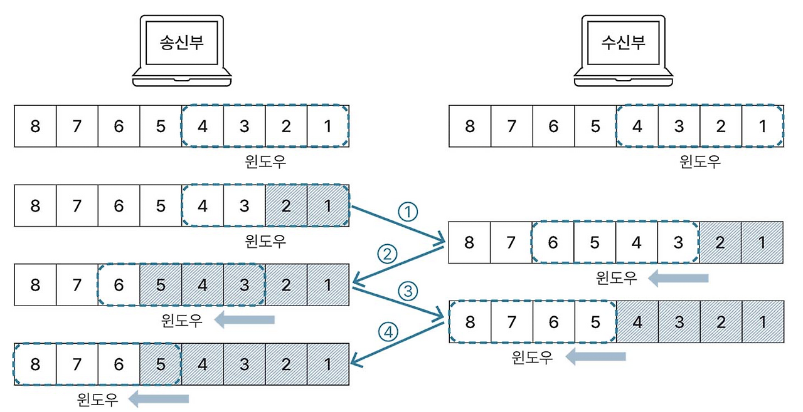

1. 송신부에서 데이터 1과 2를 보내고 3과 4를 보낼 수 있지만, 아직 보내지 않았습니다. (윈도우 범위 1 ~ 4)  
2. 수신부에서 데이터 1과 2를 받았다는 ACK메시지를 송신부로 보냅니다.  
3. 송신부에서 ACK메시지를 받고, 윈도우를 2칸 이동합니다. (윈도위 범위 3 ~ 6)  
4. 송신부에서 데이터 3,4,5를 보냅니다.  
5. 수신부에서 데이터 3과 4를 받았다는 ACK메시지를 보냅니다.  
6. 송신부에선 데이터 5에대한 ACK메시지는 받지 못했으므로, 윈도우를 3칸 이동합니다. (윈도우 범위 5 ~ 8)  

### 혼잡 제어
송신부의 데이터 전달 속도와 네트워크 속도 차이로 인해 발생하는 데이터 손실을 방지하기 위한 방법입니다.

### 혼잡
혼잡은 네트워크에 패킷 수가 과도하게 증가하는 증상을 의미합니다. 혼잡이 발생해 네트워크에 패킷이 쌓이게 되어 송신부에서 일정 시간동안 응답을 받지 못하는 경우 송신부에선 메시지 전송에 실패했다고 판단을 하고, 패킷을 재전송합니다. 이는 혼잡을 더 가중시키게 됩니다.

### 혼잡 제어하는 방법
TCP는 혼잡 윈도의 크기를 조절하는 방식인  AIMD(Additive Increase Multiplicative Decrease), 느린시작(slow start), 혼잡 회피(congestion avoidance), 빠른 회복(fast recovery), 빠른 재전송(fast retransmit) 5가지 방법으로 혼잡을 제어합니다.

### 혼잡 윈도우 크기
네트워크 혼잡을 방지하기 위해 TCP가 동적으로 조절하는 윈도우 크기입니다.

### AIMD(Additive Increase Multiplicative Decrease)
데이터를 전달시 합 증가(Additive Increase) 방식으로 혼잡 윈도우의 크기를 조절합니다.  
데이터 손실이 발생하는 경우, 혼잡 윈도우의 크기를 곱 감소(multiplicative decrease) 방식을 적용해 0.5배의 배수 단위로 줄입니다.  
AIMD 방식은 여러 송신부 간에 네트워크 대역폭을 공평하게 사용할 수 있다는 점이 있는 반면, 데이터 유실이 발생하는 경우 윈도우 크기가 증가 폭 대비 감소폭이 크기 때문에 네트워크 대역폭을 넓게 사용하기 까지 시간이 오래 걸린다는 단점이 있습니다.

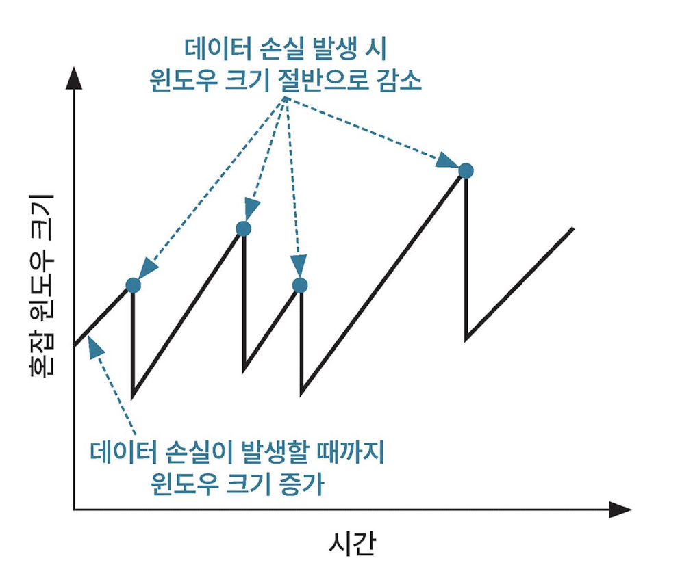

### 느린 시작(slow start)
윈도우 크기가 1인 상태에서 시작해 ACK메시지를 수신할 때마다 윈도우 크기를 1씩 늘려가고, 혼잡이 발생하게 되는 경우 윈도우 크기를 1로 줄이는 방식입니다.  
송신부가 수신부로부터 1개 패킷에 대한 ACK 응답 메시지를 받은 경우, 그 다음엔 송신부에서 2개의 패킷을 보낼 수 있습니다. 2개의 패킷을 보내고, 보낸 2개의 패킷에 대해 ACK 메시지를 받은 경우엔 패킷 4개를 보낼 수 있게 됩니다. 지수 함수의 형태로 보낼 수 있는 패킷의 갯수를 증가시킵니다.
흐름은 아래의 그림과 같습니다.

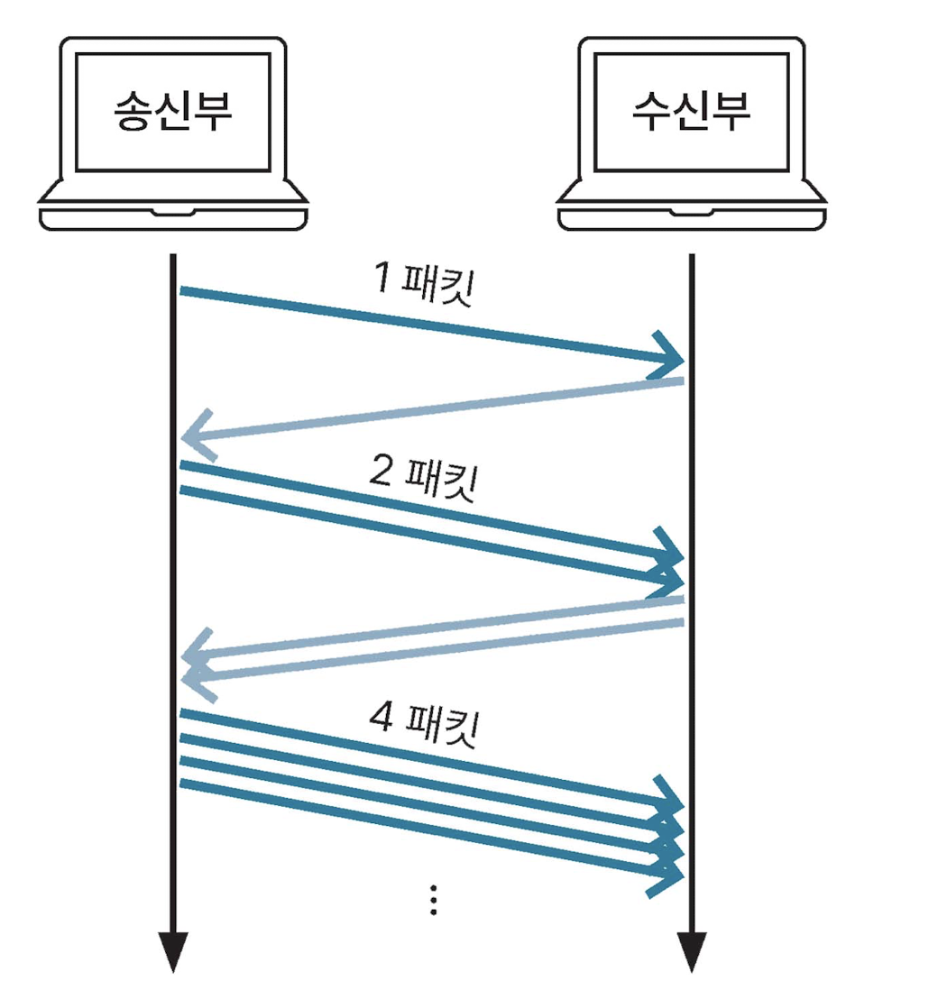

패킷을 처음에 최대한 많이 보내는 것이 아니라, 1개부터 점차 늘려가는 방식이므로 느린 시작방식으로 불립니다.  
전송 가능한 패킷 수를 지수 함수 형태로 늘리는 점은 AIMD 방식처럼 합증가 방식의 단점인 초기 전송 가능한 패킷 수가 적은 점을 보완하게 됩니다.

### 혼잡 회피(congestion avoidance)

윈도우 크기가 지수 함수 형태로 증가하다가 혼잡이 발생하는 것을 방지하기 위해 윈도우 크기에 대한 임계점을 정하는 방식입니다.
말 그대로 윈도우 크기가 임계점에 도달한 경우 윈도우의 크기를 선형적으로 증가하게 합니다.
ACK 메시지를 받지 못해 타임 아웃이 발생하는 시점에서 윈도우 크기의 절반을 임계점으로 설정하고, 윈도우 크기를 초깃값으로 변경합니다.

### 빠른 회복(fast recovery)
혼잡이 발생하는 경우 혼잡 윈도우 크기를 절반으로 줄인 후 선형적으로 증가하는 방식입니다.
혼잡이 처음 발생하는 경우엔 AIMD 방식으로 동작합니다.

### AIMD랑 빠른 회복의 차이점
AIMD는 패킷 손실 발생 후 Slow Start로 돌아갈 수 있어 회복 속도가 느립니다. Fast Recovery는 AIMD보다 빠르게 회복하기 위해 Slow Start로 돌아가지 않고, 혼잡 윈도우를 절반으로 줄인 후 선형적으로 증가하는 방식입니다.

### AIMD와 Slow Start
AIMD와 Slow Start는 다른 방식이지만, TCP 혼잡 제어에서 함께 사용됩니다.
Slow Start는 초기 연결 시 빠르게 증가하는 방식 (지수 증가)과 AIMD는 네트워크 부하를 조절하면서 서서히 증가하는 방식 (선형 증가 + 혼잡 시 절반 감소)을 사용합니다. 이로인해, Slow Start에서 AIMD로 전환하는 것이 일반적인 TCP 동작 방식입니다. 즉, AIMD와 Slow Start는 완전히 다른 개념이지만, TCP 혼잡 제어에서는 함께 사용되는 과정입니다.

### 빠른 재전송(fast retransmit)
Duplicate ACK가 3번 발생하는 경우 해당 시점의 윈도우 크기를 1/2로 줄입니다. 그뒤, ACK 메시지를 받는 경우 다시 윈도우 크기를 늘리는 방식입니다.  Duplicate ACK가 3번 발생한 경우, 혼잡이 발생했다고 판단해 윈도우 크기를 조정합니다.

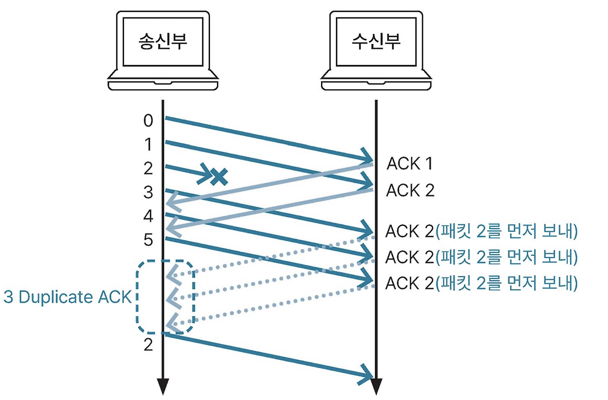

### Duplicate ACK
패킷이 순서대로 도착하지 않아서 받아야 할 차례의 패킷을 ACK 메시지와 함꼐 요청하는 것을 말합니다.
예시로, 송신부에서 패킷을 0~5까지 보냈지만, 수신부에선 패킷 2가 오지 않은 상황입니다. 수신부는 3,4,5패킷에 대한 응답으로 2패킷을 보내라는 메시지를 담아서 응답합니다. 이 응답이 3번 반복되면 송신측에서는 패킷 2를 재전송 합니다. 또한, 3번 응답이 온 시점을 기준으로 윈도우 크기를 0.5배 합니다.

### 혼잡 제어 정책
TCP는 혼잡 제어 방식을 하나만 고수하는 것이 아닌, 여러 방법을 합쳐서 혼잡 제어 정책을 사용합니다.
혼잡 발생시 윈도우 크기를 줄이거나 유지해서 혼잡을 회피하려고 합니다.
혼잡 제어 정책은 TCP Tahoe, TCP Reno, New Reno, Cubic등과 같은 혼잡 제어 정책이 있습니다. 이중 TCP Tahoe와 TCP Reno가 대표적으로 사용하는 정책입니다. 두 방식 모두 느린 시작 방식을 사용하다 임계점을 넘어가는 경우 AIMD 방식으로 전환하게 됩니다.
이 때의 임계점은 느린 시작 방식의 임계점을 의미해서 ssthresh(slow start threshold)라고 합니다.

### TCP Tahoe
초반에 느린 시작을 사용해 혼잡 윈도우 크기를 지수적으로 키웁니다. 그러다가 혼잡이 발생했다고 판단이 되는 경우 윈도우 크기의 절반을 임계점으로 설정하고 혼잡 윈도우 크기를 초기화 합니다.
TCP Tahoe는 아래 그림과 같이 동작합니다.

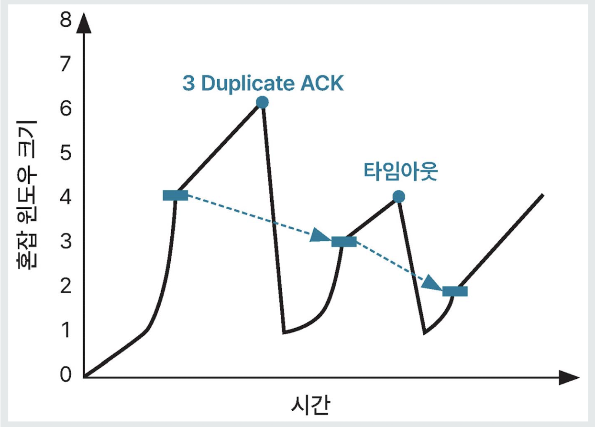

1.slow start 방식으로 혼잡 윈도우의 크기를 지수적으로 키웁니다.
2.지수적으로 키우다가 sshthresh인 4에 도달하는 경우 AIMD 방식을 사용해 혼잡 윈도우 크기를 선형적으로 키웁니다.
3.혼잡 윈도우 크기가 선형적으로 커지다가 크기가 6이 된 경우, 3 Duplicate ACK가 발생합니다. 이로 인해 혼잡 윈도우 크기를 1로 초기화 하고 ssthresh값을 혼잡이 발생한 크기의 6의 절반인 3으로 줄입니다.
4.윈도우 크기가 4일 때 타임 아웃이 발생하면서, 윈도우 크기를 1로 초기화 하고 ssthresh 값을 2로 변경하게 됩니다.

### TCP Reno
TCP Tahoe와 동일하게 초반엔 느린 시작을 사용하지만, 3 Duplicate ACK와 타임아웃을 구분해 대응합니다.  
3 Duplicate ACK가 발생하는 경우 혼잡 윈도우 크기를 절반으로 줄이고, 줄인 혼잡 윈도우 크기를 ssthresh값으로 설정합니다.  
타임 아웃이 발생하는 경우엔 TCP Tahoe와 마찬가지로 혼잡 윈도우 크기를 1로 초기화 합니다. 이때 ssthresh값은 변경하지 않습니다.  

1. 혼잡 윈도우 크기를 slow start 방식으로 지수적으로 키웁니다.  
2. ssthresh값인 4에 도달할 경우 AIMD방식으로 혼잡 윈도우 크기를 선형적으로 키웁니다.  
3. 혼잡 윈도우 크기가 6에 도달한 경우 3 Duplicate ACK가 발생해 혼잡 윈도우 크기를 절반으로 줄이고, ssthresh 값도 혼잡 윈도우 크기와 동일하게 설정합니다.  
4. 혼잡 윈도우 크기가 5가 되었을때, 타임아웃이 발생하면 ssthresh값은 유지하지만, 혼잡 윈도우 크기는 1로 줄입니다.  
5. 혼잡 윈도우 크기는 지수적으로 증가하다가 ssthresh 값인 3에 도달하면 선형적으로 증가합니다.  

### 오류 제어
통신 중에 데이터 오류 또는 유실이 발생하는 경우 데이터의 신뢰성 보장을 위해 오류를 제어하는 방식입니다.

### 오류 또는 유실을 아는 방법
수신부에서 잘못된 데이터를 받았다는 응답인 NAK(Negative Acknowledge) 메시지를 보낸 경우  
3 Duplicate ACK가 발생한 경우  
수신부로부터 ACK 메시지를 받지 못해 타임아웃이 발생한 경우  

### TCP가 오류를 제어하는 방법
오류를 제어하는 방식에는 정지대기, Go-Back-N ARQ, Selective-Repeat ARQ 방식이 있습니다.

### 정지 대기(stop-wait)
타임아웃이 발생하는 경우 해당 패킷을 다시 보내는 방식입니다.
흐름 제어에 나온 방식으로 데이터 유실을 간단히 처리할 수 있어서 오류 제어에도 사용됩니다.

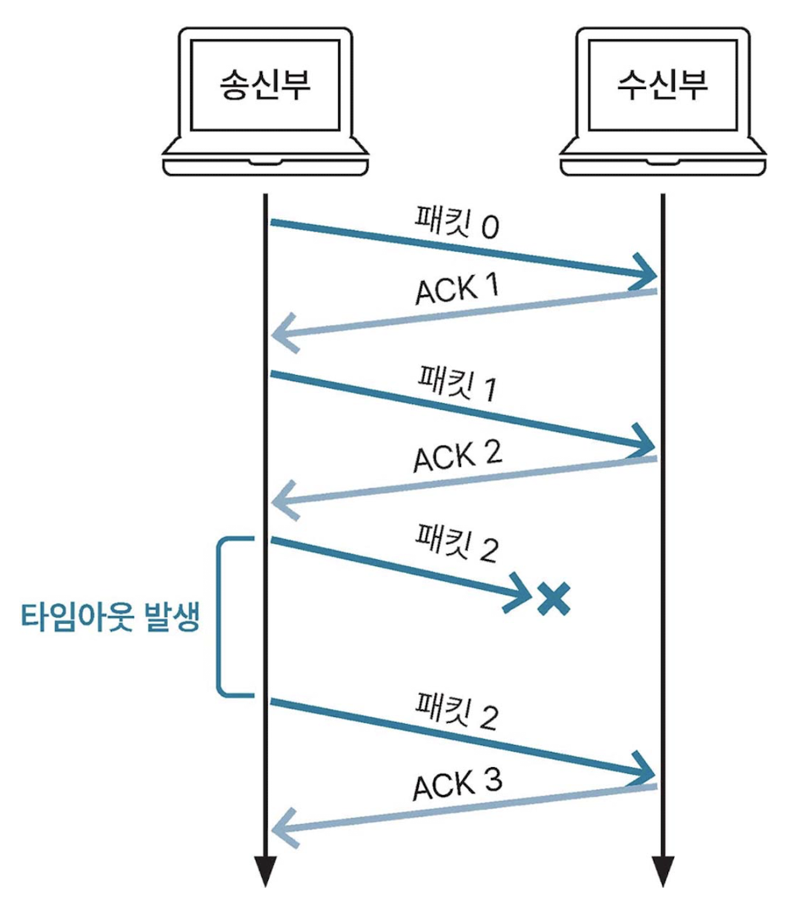

이 방식은 ARQ(Automatic Repeat Request)이며, 데이터 전송 중 오류가 발생하면 해당 데이터를 다시 요청하여 전송하는 방식입니다.
즉, 정지 대기 방식은 ARQ방식의 하나입니다.

### Go-Back-ARQ
송신부에서 연속적으로 데이터를 보내는 경우, 누락된 데이터가 있으면 송신부에서 해당 데이터부터 재전송하는 방식입니다.

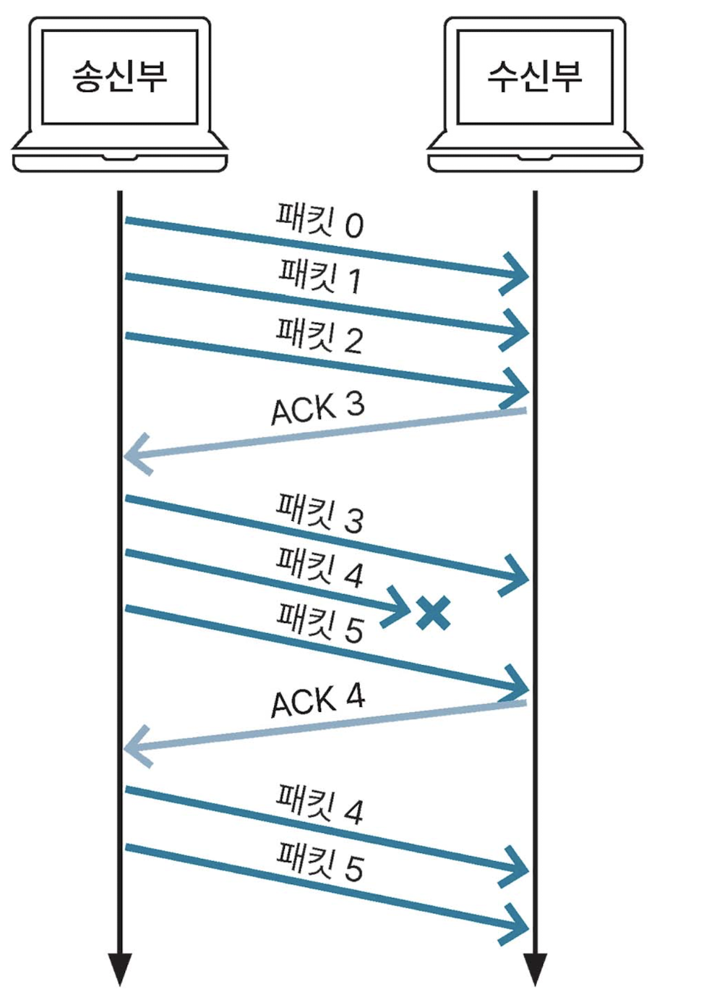

1. 송신부에서 패킷 0~2까지 보냅니다.  
2. 0~2번 패킷까지 전달받은 수신부는 ACK 3 메시지를 보냅니다.  
3. 송신부는 3~5번 패킷을 수신부로 보냅니다.  
4. 수신부는 4번 패킷을 받지 못해 ACK 4 메시지를 보냅니다.  
5. 송신부에서 ACK 4메시지를 받게 되면, 송신부는 이전에 보냈던 4번 패킷을 포함한 4~5번 패킷을 재전송합니다.  

### Selective-Repeat-ARQ

송신부에서 연속적으로 데이터를 보내는 경우, 누락된 데이터가 발견되면 수신부에서 해당 데이터만 재전송을 요청하는 방식입니다.

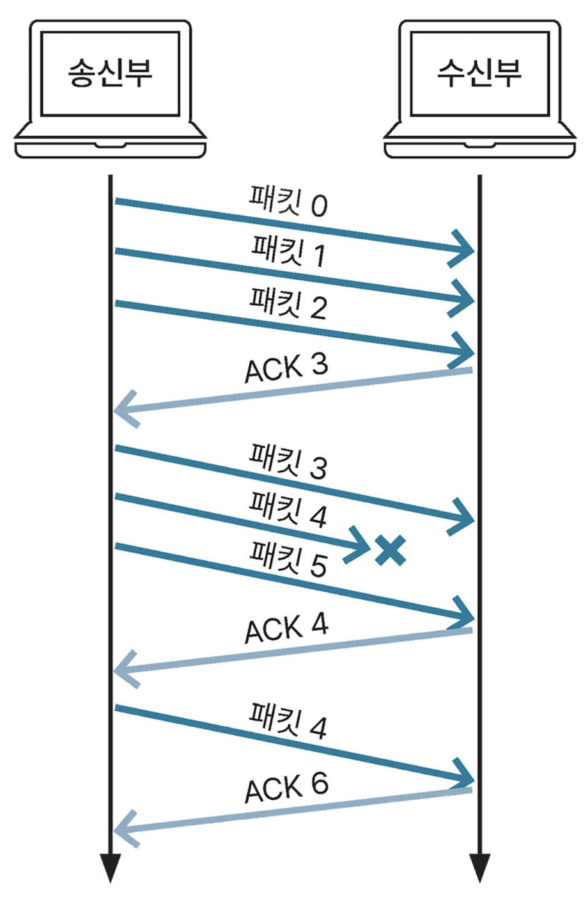

1. 수신부에서 패킷 0~2까지 잘 수신하면 패킷 3을 보내라는 의미로 ACK 3메시지를 보냅니다.  
2. ACK 메시지를 수신받은 송신부에서 패킷 3~5까지 보냅니다.  
3. 수신부에서 패킷 4를 받지 못해서, 패킷 4를 보내라는 의미로 ACK 4 메시지를 보냅니다.  
4. 송신부는 ACK 4 메시지를 받은 후, 4번 패킷을 수신부로 보냅니다.  
5. 수신부는 4번 패킷을 받고, ACK6 메시지를 송신부에 보내 6번 패킷부터 보내도록 요청합니다.  

누락된 특정 패킷만 재전송하는 점이 효율적일 수는 있지만, 받은 패킷을 수신부 측에서 재정렬해야 한다는 점이 존재합니다.  

### 정리
-TCP는 신뢰성을 보장하기 위해 흐름 제어, 혼잡 제어, 오류 제어를 사용하며, 이를 통해 패킷 손실 및 네트워크 혼잡을 방지합니다.  
- 흐름 제어는 송신부와 수신부 간의 데이터 처리 속도 차이를 조정하며, 정지 대기(Stop-and-Wait)와 슬라이딩 윈도우(Sliding Window) 방식이 사용됩니다.  
- 혼잡 제어는 네트워크의 패킷 과부하를 방지하기 위해 혼잡 윈도우 크기를 조절하며, AIMD, 느린 시작(Slow Start), 혼잡 회피(Congestion Avoidance), 빠른 회복(Fast Recovery), 빠른 재전송(Fast Retransmit) 등의 방법을 적용합니다.  
- 오류 제어는 데이터 손실 및 오류 발생 시 재전송을 통해 신뢰성을 유지하며, 정지 대기 ARQ, Go-Back-N ARQ, Selective Repeat ARQ 방식이 사용됩니다.  
- TCP 혼잡 제어 정책으로는 TCP Tahoe와 TCP Reno가 있으며, 느린 시작과 AIMD 방식을 결합하여 혼잡 발생 시 윈도우 크기를 조정하고 효율적인 데이터 전송을 보장합니다. 
