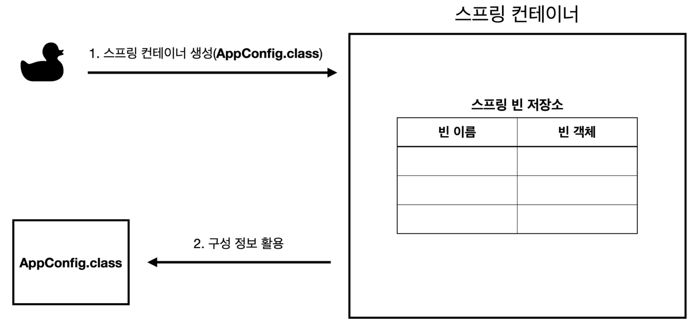
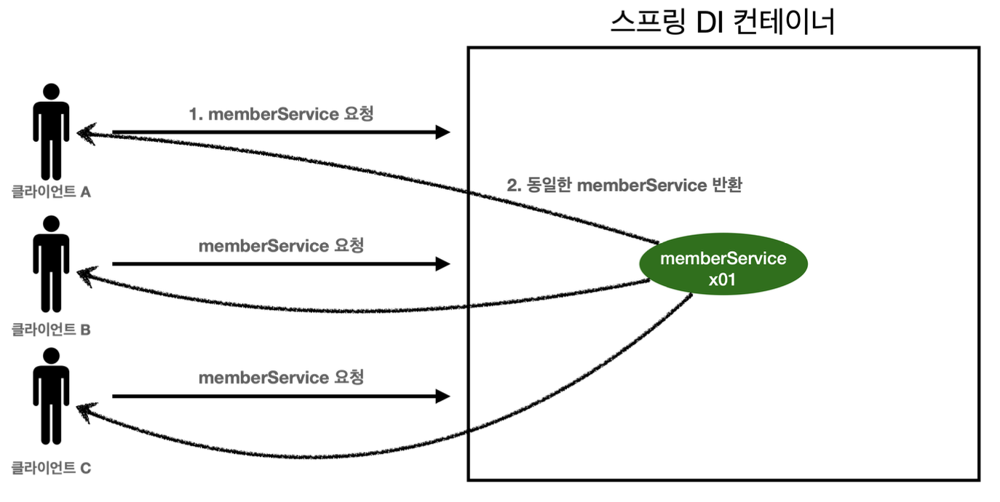
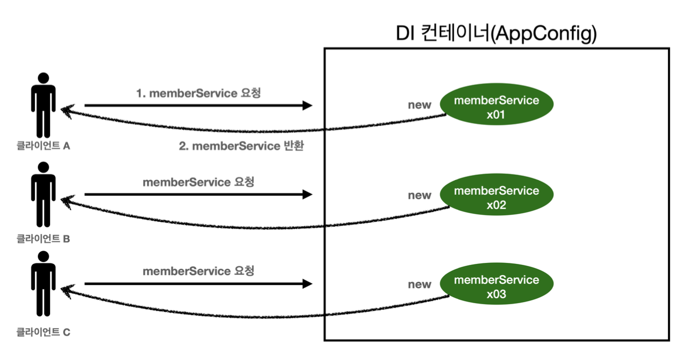

# IoC와 DI
## 객체지향 설계와 스프링
### 객체지향 설계 원칙과 DI의 필요성
객체지향 설계 원칙 중 **OCP(Open-Closed Principle)**, **DIP(Dependency Inversion Principle)**를 지키기 위해서는
- 구현체에 의존하지 않고
- 인터페이스에 의존하면서도
- 객체 생성과 연결을 유연하게 처리해야 함

### 순수 자바로 직접 설계하면 발생하는 문제
```java
public class OrderService {
    private final MemberService memberService = new MemberServiceImpl();
}
```
- OCP 위반: 구현체(MemverServiceImpl)에 강하게 의존
- DIP 위반: 구체 클래스에 의존하고 있음

### 해결책 = 의존성 주입(DI)
- 객체 생성과 연결을 외부로 분리
- 객체 간의 결합도를 낮춰 유지보수성과 확장성을 확보

### 스프링의 역할
- 객체를 대신 생성하고 관리하는 **IoC 컨테이너** 제공
- 의존성을 자동으로 주입해주는 **DI 기능** 제공
- 다형성 극대화, 유연한 구조 구현 가능

---

## 스프링 컨테이너와 스프링 빈



### 스프링 컨테이너란?
- 객체를 생성하고 관리하는 중앙 저장소이자 제어 주체
- 가장 많이 쓰는 구현체: ApplicationContext
- 컨테이너 내부에는 객체들이 **빈(Bean)**으로 저장되어 관리됨

### 스프링 빈이란?
- @Component, @Configuration, @Bean 등으로 등록된 객체
- 스프링이 직접 생성하고 관리하는 객체
- 등록된 빈은 getBean() 또는 @Autowired 등을 통해 주입됨

### 빈 등록 방식
스프링 프로젝트를 생성하면 기본적으로 Application 클래스가 존재한다.

클래스에는 `@SpringBootApplication`가 붙어있고, 해당 어노테이션의 메타 어노테이션으로 `@ComponentScan`이 붙어 `@Component`를 자동으로 컨테이너에 등록해준다. `@Configuration`의 경우 메타 어노테이션에 `@Component`가 붙어 있어서 마찬가지로 자동으로 컨테이너에 등록해준다.
- @Component: 자동 등록(컴포넌트 스캔 대상)
- @Bean: 수동 등록(설정 클래스 내에서 직접 등록)
- @Configuration: 설정 클래스 지정(내부적으로도 @Componen 포함)

### 빈 생명주기
스프링 IoC 컨테이너 생성 → 스프링 빈 생성 → 의존관계 주입 → 초기화 콜백 메서드 호출 → 빈 사용 → 소멸 전 콜백 메서드 호출 → 스프링 종료

### 빈 생명주기 콜백의 필요성
스프링 빈은 객체를 생성한 후 의존관계가 모두 주입되어야 비로소 사용할 준비가 완료된다. 초기화 작업이 필요한 경우 스프링은 의존관계 주입이 완료된 시점에 자동으로 호출되는 콜백 메서드를 제공하여 개발자가 초기화 타이밍을 정확히 파악하고 로직을 수행할 수 있게 한다.

또한, 스프링 컨테이너가 종료되기 직전에는 소멸 콜백 메서드를 통해 필요한 정리 작업을 안전하게 처리할 수 있도록 지원한다.

### 빈 생명주기 콜백 함수
스프링은 의존관계 주입이 완료되면 스프링 빈에게 콜백 메서드를 통해서 초기화 시점을 알려주는 다양한 기능을 제공한다.

스프링 컨테이너가 종료되기 직전에도 소멸 콜백을 주어 안전하게 종료작업을 진행할 수 있다.

#### 인터페이스(InitializingBean, DisposableBean)
```java
public class MyBean implements InitializingBean, DisposableBean {
    public void afterPropertiesSet() { ... }
    public void destroy() { ... }
}
```
- 스프링 인터페이스 직접 구현
- 유연성이 떨어지기 때문에 실무에서는 잘 안 씀

#### 설정 정보에 초기화 메소드, 종료 메소드 지정(@Bean(initMethod = "init", destroyMethod = "close"))
```java
@Bean(initMethod = "init", destroyMethod = "cleanup")
public MyBean myBean() {
    return new MyBean();
}
```
- 외부 라이브러리 객체 등 수정할 수 없는 클래스에 사용
- 설정 클래스에서 콜백 지정 가능

#### @PostConstruct, @PreDestroy 어노테이션 지원
```java
@PostConstruct
public void init() {
    // 의존성 주입 완료 후 호출
}

@PreDestroy
public void cleanup() {
    // 컨테이너 종료 직전 호출
}
```
- 가장 깔끔하고 권장되는 방법
- 자바 표준(JSR-250), 스프링 외에도 작동 가능

---

## 스프링 빈 스코프
### 스코프란?
> 빈이 생성되고 유지되는 범위를 지정하는 설정

### 주요 스코프 종류
- singleton(기본값)
    - 컨테이너당 하나의 객체만 생성
    - 모든 요청에 재사용됨



- prototype
    - 요청 시마다 새로운 객체 생성
    생성 이후 생명주기는 스프링이 관리하지 않음



- request
    - HTTP 요청마다 별도 객체 생성
- session
    - HTTP 세션마다 객체를 유지
- application
    - 서블릿 컨텍스트 범위에서 객체 유지

---

## 의존성 주입 방법
### 생성자 주입
```java
@Component
public class OrderService {

    private final MemberService memberService;

    // 생성자 주입
    @Autowired
    public OrderService(MemberService memberService) {
        this.memberService = memberService;
    }
}
```
- final 키워드로 불변성 보장
- 테스트 시 생성자로 직접 주입 가능 → 순수 Java 테스트 가능
- 생성자가 1개뿐이면 @Autowired 생략 가능

### Setter 주입
```java
@Component
public class OrderService {

    private MemberService memberService;

    // Setter 주입
    @Autowired
    public void setMemberService(MemberService memberService) {
        this.memberService = memberService;
    }
}
````
- @Autowired가 붙은 Setter를 통해 주입
- 선택적인 의존성일 때 유용함 (예: Logger 등 없어도 되는 것들)
- 하지만 Setter가 public이라 외부에서 변경될 위험 있음 → 구조적으로 불안정

### 필드 주입
- 코드가 가장 간결
- 하지만 테스트 코드에서 주입하기 어려움
- final을 사용할 수 없고, 객체 불변성이 깨짐

## 제어의 역전 IoC(Inversion of Control)
- xml파일, 어노테이션(@Bean)으로 스프링 컨테이너에 객체를 등록하면 스프링 컨테이너에서 객체의 생명주기를 관리
- 즉, 객체의 제어권이 컨테이너(스프링)으로 바뀌기 때문에 제어의 역전(IoC)라 부름
- IoC가 없다면 개발자가 직접 객체를 제어해야 함
    - 객체 생성, 의존성 설정 등등

### 스프링 빈을 스프링 컨테이너에서 꺼내오는 과정
#### BeanFactory란?
> BeanFactory는 스프링 빈을 조회하거나 관리하는 가장 기본적인 인터페이스
- getBean() 메서드를 통해 빈을 이름 또는 타입으로 꺼낼 수 있음
- DI를 가능하게 해주는 핵심 기능을 포함

```java
public interface BeanFactory {
    Object getBean(String name) throws BeansException;
}
````

ApplicationContext는 BeanFactory를 상속한 상위 인터페이스

우리가 실무에서 자주 쓰는 `@Autowired`, `@ComponentScan` 기반 DI도 대부분 이 ApplicationContext에서 처리됨

#### SpringApplication.run()의 내부 흐름
```java
public static void main(String[] args) {
    ConfigurableApplicationContext context = SpringApplication.run(MyApplication.class, args);
}
```
1.	run() 호출
2.	내부적으로 ApplicationContext 구현체 생성
    - 예: AnnotationConfigApplicationContext GenericWebApplicationContext
3.	@ComponentScan 수행 → BeanDefinition 생성
4.	빈 인스턴스 생성 (new)
5.	의존관계 주입 (DI)
6.	초기화 콜백 호출 (@PostConstruct 등)
7.	컨텍스트 반환 (→ context.getBean() 가능)